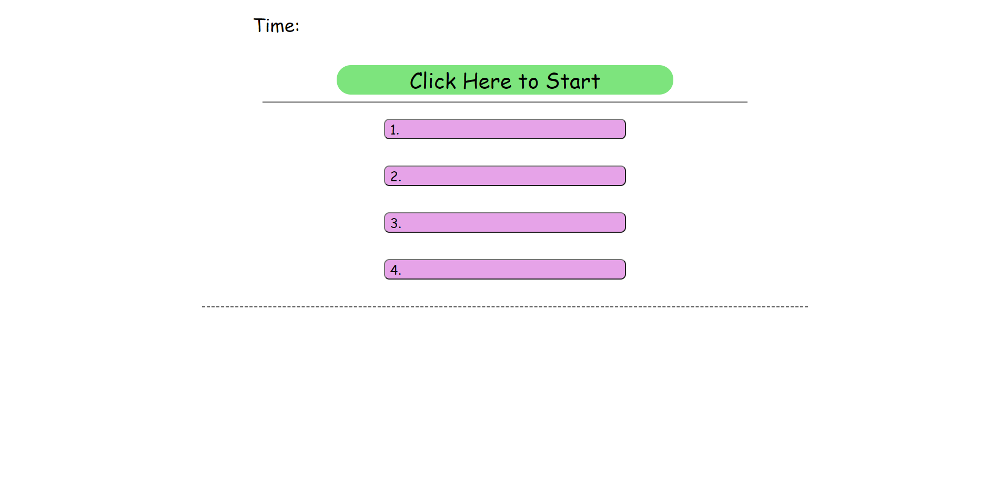

# Challenege4-Code-Quiz

## By: Troy Grossi

Note:
Unfortunately I ran into a bug trying to switch pages to get the initials and final score. I was also not able to extract any data from the elements on the initial.html page, so there are a couple functions in the script that I left as a hot mess. This bug had me trouble shooting so long that the assignment is unfinished but figured I would turn in what I have.

### Features:

- Start button that acivates timer
- A series of questions that appear after completion of the previous
- Time subtracted when question answered wrong
- Quiz ends when time reaches zero or all questions are answered
- Initials and score is saved when game ends

link: https://troygrossi.github.io/Challenge4-Code-Quiz/

ScreenShot:

